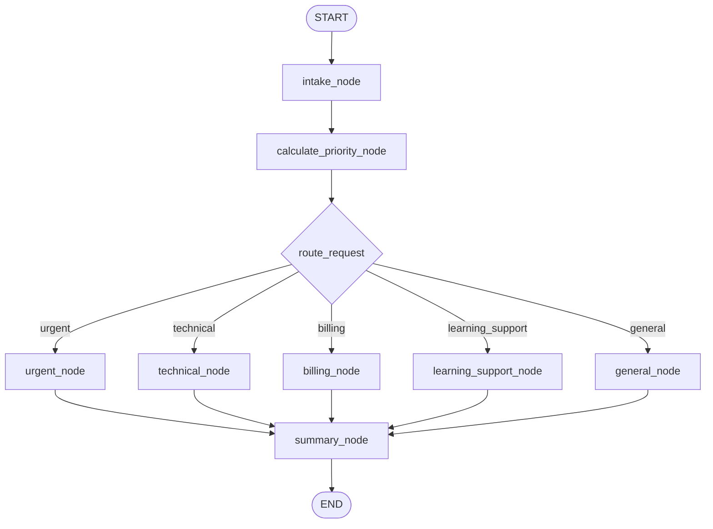

# Week 3 Assignment: Build a Smart Support Triage Workflow with LangGraph

## Context

Your engineering team receives help requests from bootcamp learners. Some requests are
urgent, some are technical issues, some are enrollment or billing questions, and some
can be answered with general guidance.

Build a deterministic LangGraph workflow that accepts a learner's support request,
evaluates it, routes it to the appropriate response path, and returns a complete triage
result.

This assignment focuses on the Week 3 building blocks. You do **not** need an LLM,
external API, database, memory, or tools.

## Learning Goals

By completing this assignment, you will demonstrate that you can:

- Apply Python type hints such as `str`, `int`, `bool`, `list`, `dict`, `Union`/`|`,
  and `Literal`.
- Define a shared LangGraph state with `TypedDict`.
- Build node functions that read state and return partial state updates.
- Connect nodes using `StateGraph`, `START`, and `END`.
- Use conditional edges to route execution based on the state.
- Compile and invoke a workflow with multiple inputs.
- Visualize a compiled graph as a Mermaid diagram.

## The Challenge

Create a **Learner Support Triage Agent**. The workflow must take an initial request
such as:

```python
{
    "learner_name": "Ada",
    "email": "ada@example.com",
    "category": "technical",
    "message": "My project will not run and the submission is due tonight.",
    "days_until_deadline": 0,
    "is_paid_student": True,
    "priority_score": 0,
    "priority": "normal",
    "route": "general",
    "assigned_team": "",
    "status": "new",
    "response": "",
    "audit_log": []
}
```

and return a final result that includes its route, priority, team assignment, response,
and an audit trail of the graph's decisions.

Example final result:

```python
{
    "learner_name": "Ada",
    "category": "technical",
    "priority_score": 95,
    "priority": "urgent",
    "route": "urgent",
    "assigned_team": "on_call_instructor",
    "status": "escalated",
    "response": "Ada, your deadline-related technical issue has been escalated...",
    "audit_log": [
        "Request received for Ada.",
        "Priority calculated: urgent (95).",
        "Urgent escalation assigned to on_call_instructor.",
        "Triage summary completed."
    ]
}
```

Your exact wording and scoring formula may differ, as long as the required behavior is
clear and consistent.

## Required State Schema

Create an `AgentState` `TypedDict`. It must contain at least these fields:

| Field | Type | Purpose |
| --- | --- | --- |
| `learner_name` | `str` | Person submitting the issue |
| `email` | `str` | Contact email |
| `category` | `Literal["technical", "billing", "course_content", "general"]` | Submitted request category |
| `message` | `str` | Learner's request |
| `days_until_deadline` | `int` | Days before the learner's deadline |
| `is_paid_student` | `bool` | Whether the learner is enrolled in a paid track |
| `priority_score` | `int` | Numeric score calculated by the workflow |
| `priority` | `Literal["low", "normal", "urgent"]` | Human-readable priority |
| `route` | `Literal["urgent", "technical", "billing", "learning_support", "general"]` | Selected branch |
| `assigned_team` | `str` | Team responsible for follow-up |
| `status` | `str` | Current triage outcome |
| `response` | `str` | Message prepared for the learner |
| `audit_log` | `list[str]` | Short record of decisions made |

You may add extra typed fields where useful, but do not replace `AgentState` with an
untyped `dict`. For this assignment, provide initial/default values for result fields
in each input state, as shown in the example. Nodes will replace those defaults as the
workflow runs.

## Workflow Requirements

Your graph must implement the following flow:



### 1. Intake Node

Create an `intake_node(state: AgentState) -> dict` function that:

- Reads the learner name, email, category, and message from the input state.
- Sets an initial `status`, such as `"received"`.
- Creates or updates `audit_log` with an entry confirming receipt.

Assume test inputs include every required initial input field. Input validation beyond
simple checks is optional.

### 2. Priority Calculation Node

Create a `calculate_priority_node(state: AgentState) -> dict` function that:

- Produces `priority_score` and `priority`.
- Applies at least three understandable business rules.

Your rules must include:

- A request with `days_until_deadline <= 1` receives urgent treatment.
- A technical problem receives higher priority than a general request.
- A message containing an emergency keyword such as `"blocked"`, `"cannot submit"`,
  `"charged twice"`, or `"deadline"` can raise the priority.

Document your scoring rules as short comments or Markdown immediately before the
function.

### 3. Conditional Router

Create a routing function with a typed return value:

```python
def route_request(
    state: AgentState,
) -> Literal["urgent", "technical", "billing", "learning_support", "general"]:
    ...
```

The function must route:

- Any `"urgent"` priority request to `"urgent"`, regardless of category.
- Non-urgent `"technical"` requests to `"technical"`.
- Non-urgent `"billing"` requests to `"billing"`.
- Non-urgent `"course_content"` requests to `"learning_support"`.
- All remaining requests to `"general"`.

Connect this router using `graph.add_conditional_edges(...)`.

### 4. Route-Specific Nodes

Create all five branch nodes:

- `urgent_node`
- `technical_node`
- `billing_node`
- `learning_support_node`
- `general_node`

Each node must return partial state updates setting:

- `route`
- `assigned_team`
- `status`
- `response`
- An additional entry in `audit_log`

Each route must produce a meaningfully different team assignment and learner response.

### 5. Summary Node

After every branch, run `summary_node(state: AgentState) -> dict`.

This node must:

- Add a final audit-log entry.
- Set a final status, such as `"triaged"` or preserve `"escalated"` for urgent
  requests.
- Produce or enhance a readable final `response` that includes the assigned team and
  priority.

### 6. Build, Compile, and Visualize the Graph

Your submission must:

- Instantiate `StateGraph(AgentState)`.
- Add all required nodes.
- Add the `START` edge, conditional edges, branch-to-summary edges, and `END` edge.
- Compile the workflow.
- Display the compiled graph using `draw_mermaid_png()` in a notebook, or print the
  Mermaid text using `draw_mermaid()` in a Python script.

## Required Test Invocations

Invoke your compiled workflow at least five times, once for each expected route:

| Test | Minimum Scenario | Expected Route |
| --- | --- | --- |
| 1 | Technical request with a deadline today or emergency keyword | `urgent` |
| 2 | Technical request with several days remaining | `technical` |
| 3 | Non-urgent payment/refund request | `billing` |
| 4 | Non-urgent question about an assignment or lesson | `learning_support` |
| 5 | Non-urgent general request | `general` |

For each test:

- Start with all required `AgentState` fields, using default result values like those
  shown in the challenge example.
- Print the initial request.
- Print the final `route`, `priority`, `assigned_team`, `status`, and `response`.
- Print the complete `audit_log`.

Add simple assertions demonstrating that routing worked:

```python
result = workflow.invoke(urgent_request)
assert result["route"] == "urgent"
assert result["priority"] == "urgent"
assert result["assigned_team"] == "on_call_instructor"
```

Use the team name that matches your own design if it differs from this example.

## Deliverables

Submit one of the following:

- `week_3/learner_support_triage.ipynb`, including explanations, graph visualization,
  implementation, and all five invocation results.
- `week_3/learner_support_triage.py`, plus a screenshot or exported image of the graph
  visualization.

Also include a short reflection answering:

1. Why is `TypedDict` useful for LangGraph state?
2. Why should nodes return only updates instead of rebuilding unrelated state fields?
3. How does the conditional edge make this workflow more useful than a linear graph?
4. Which additional branch or state field would you add in a real support system?

## Constraints

- Use `TypedDict` for the graph state.
- Use type hints on every node and on the routing function.
- Use a `Literal[...]` return type for the routing function.
- Use `START`, `END`, and `add_conditional_edges`.
- Do not use an LLM or external APIs for the required solution.
- Do not route with a large `if` statement outside the graph after invoking it; routing
  must occur inside the graph.

## Evaluation Rubric

| Criterion | Points | Evidence |
| --- | ---: | --- |
| Typed state and Python typing | 15 | Correct `TypedDict`, type hints, `Literal` route values, and typed collections |
| Graph construction | 20 | Correct nodes, `START`/`END`, compiled workflow, and summary convergence |
| Conditional routing | 20 | Correct five-way router and behavior for urgent override |
| Node logic and state updates | 20 | Priority rules, distinct branch responses, teams, statuses, and audit log |
| Testing and visualization | 15 | Five invocations, assertions, printed outputs, and Mermaid visualization |
| Explanation and code quality | 10 | Clear naming, readable rules, and thoughtful reflection |
| **Total** | **100** | |

## Stretch Challenges (Optional)

Complete these only after the required workflow works:

- Add a `"career_support"` category and branch without breaking existing tests.
- Add a `follow_up_hours: int` state value that differs by priority and route.
- Create a small list of test cases and invoke the graph in a loop, printing a compact
  triage report for each request.
- Use a Pydantic model to validate input data before it is passed to the graph, while
  keeping the LangGraph state typed with `TypedDict`.

## Instructor Notes

This assignment deliberately stops before model calls, tool use, checkpointers,
interrupts, and multi-agent patterns. It reinforces Week 3's stateful graph and
conditional-routing fundamentals before later lessons introduce more agentic behavior.
